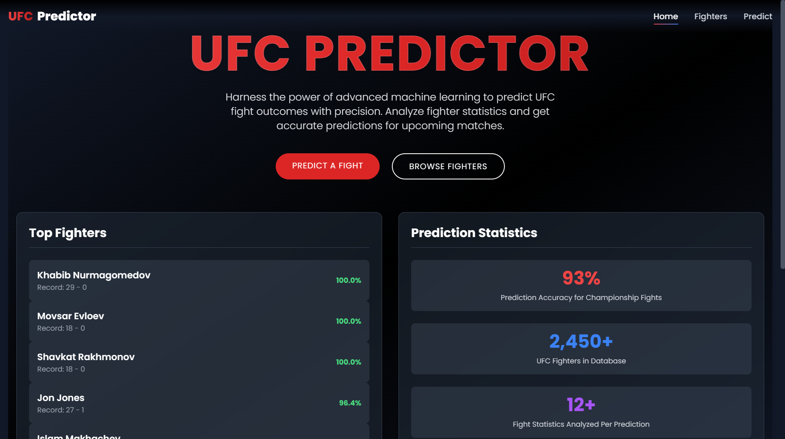
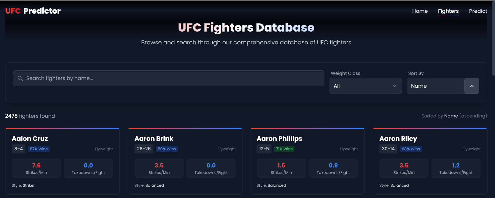
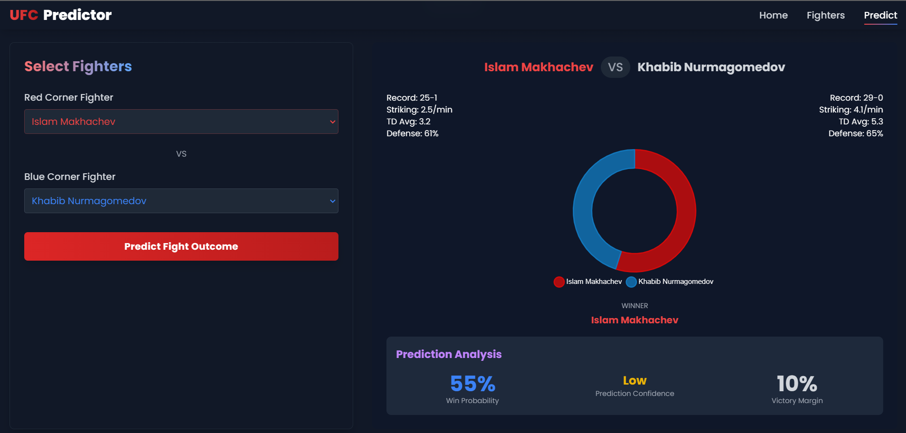

<p align="center">
  
  
  
  
</p>

# Mo's UFC Predictor

**UFC Predictor** is a machine learning-powered web application that predicts fight outcomes in the **Ultimate Fighting Championship (UFC)**. Using advanced neural networks and a comprehensive database of fighter statistics, this tool provides **data-driven predictions** for upcoming UFC matchups with detailed probability analysis.

### 🔥 Live Demo: [UFC Predictor](https://ufcpredictor.vercel.app/)

---

## 📌 Application Infrastructure

The application is deployed using **AWS and Vercel**, ensuring high availability and scalability:

- **Backend**: Hosted on an **AWS EC2 Ubuntu Instance**, running a Flask-based REST API for predictions and fighter statistics. The instance is optimized for **ML inference** and **high-throughput API requests**.
- **Frontend**: Deployed on **Vercel**, providing a **fast and globally distributed** React-based UI with automatic scaling and zero-downtime deployments.
- **Reverse Proxy & Load Balancing**: Configured using **NGINX** on the EC2 instance to efficiently route traffic between the API, ML model, and database, optimizing response times and security.

---

## 🖥️ Application Screenshots

### Home Page

*The home page showcases top fighters, prediction statistics, and the main features of the UFC Predictor application. The system boasts **93% prediction accuracy** for championship fights and contains data on **2,450+ UFC fighters**.*

### Fighter Database

*Browse through our **comprehensive database** of UFC fighters with detailed statistics including win rate, striking metrics, and takedown averages.*

### Prediction Interface

*Select fighters from different corners and get **detailed prediction analysis** with **win probabilities** and **confidence ratings**. The system analyzes **physical advantages, fighting styles, and historical performance**.*

---

## 🚀 Features

### 🔬 AI-Driven Fight Predictions
- **Ensemble Machine Learning Model**: XGBoost, Random Forest, Gradient Boosting, and Logistic Regression for improved accuracy.
- **Neural Network Model**: PyTorch deep learning model with **multiple hidden layers, batch normalization, and dropout**.
- **Probability Analysis**: Detailed **win probability calculations** with **confidence ratings**.
- **Physical Matchup Evaluation**: Weight class, reach, and other **physical advantages** integrated into the model.

### 📊 Fighter Database
- **Comprehensive Statistics**: Track records, physical attributes, and performance metrics for **2,450+ fighters**.
- **Fighter Comparisons**: Side-by-side comparison of **fighting styles and statistics**.
- **Historical Data**: Access to **past UFC fight results** for analysis.

### 🎨 Modern Web Interface
- **Responsive Design**: Built with **React and Tailwind CSS**.
- **Interactive Visualizations**: Dynamic **charts powered by Chart.js**.
- **User-Friendly**: Intuitive interface for **both casual fans and MMA analysts**.

---

## 🛠️ Tech Stack

### Backend
- **AWS EC2 Ubuntu Instance**: Hosting Flask API with an **optimized server environment**.
- **NGINX**: Reverse proxy and **load balancer** for API efficiency and security.
- **Flask**: REST API framework for **ML model inference**.
- **PyTorch**: Deep learning framework for fight prediction.
- **XGBoost/Scikit-learn**: Machine learning model implementation.
- **SQLite**: Fighter and fight data storage.
- **Pandas/NumPy**: Data processing and analysis.

### Frontend
- **Vercel**: Fast and **globally distributed** deployment of React-based UI.
- **React**: UI component library for **frontend development**.
- **Tailwind CSS**: Utility-first CSS framework for styling.
- **Chart.js**: Data visualization for fight predictions.
- **Axios**: HTTP client for API communication.

---

## ☁️ Deployment and Hosting

### AWS EC2 Ubuntu Instance
The backend is deployed on an **AWS EC2 Ubuntu instance**, optimized for **low-latency ML inference**:

1. **Instance Setup**:
   ```bash
   sudo apt update && sudo apt upgrade -y
   sudo apt install python3-pip nginx
   ```

2. **Flask API Deployment**:
   ```bash
   git clone https://github.com/mo100saad/ufc-predictor.git
   cd ufc-predictor/backend
   python3 -m venv venv
   source venv/bin/activate
   pip install -r requirements.txt
   gunicorn -w 4 -b 0.0.0.0:5000 main:app
   ```

3. **NGINX Configuration for Load Balancing**:
   ```nginx
   server {
       listen 80;
       location / {
           proxy_pass http://127.0.0.1:5000;
           proxy_set_header Host $host;
           proxy_set_header X-Real-IP $remote_addr;
       }
   }
   ```
   ```bash
   sudo systemctl restart nginx
   ```

### Frontend Deployment on Vercel
The **React frontend** is deployed on **Vercel** for seamless **scaling and performance**:
```bash
vercel login
vercel init
vercel deploy
```

---

## 🔗 API Endpoints

| Method | Endpoint | Description |
|--------|---------|-------------|
| **GET** | `/api/health` | Health check for API status |
| **POST** | `/api/predict` | Predicts fight outcome between two fighters |
| **GET** | `/api/fighters` | Returns list of all fighters in the database |
| **GET** | `/api/fighter/{name}` | Retrieves detailed stats for a specific fighter |
| **GET** | `/api/fights` | Returns list of recorded fights |

---

## 📅 Future Roadmap

### 🏆 Enhanced Prediction Model
- **Fighter style matchup analysis**.
- **Time-series analysis** of fighter performance trends.
- **Incorporating coaching/training camp data**.

### 📈 Advanced Features
- **User accounts** with saved predictions.
- **Live odds comparison** with major sportsbooks.
- **Betting strategy recommendations**.

---

## 🤝 Contributing

Contributions are **welcome**! Please feel free to **submit a Pull Request**.

```bash
# Fork the repository
# Create your feature branch
git checkout -b feature/amazing-feature
# Commit your changes
git commit -m 'Add some amazing feature'
# Push to the branch
git push origin feature/amazing-feature
# Open a Pull Request
```

---

## 📜 License

This project is **Creative Commons Attribution-NonCommercial-NoDerivatives 4.0 International** license.  
See the **[LICENSE](LICENSE)** file for details.

---

## 📬 Contact

**Mohammad Saad** - [@mo100saad](https://github.com/mo100saad)  

**Project Repository**: [GitHub](https://github.com/mo100saad/ufc-predictor)

