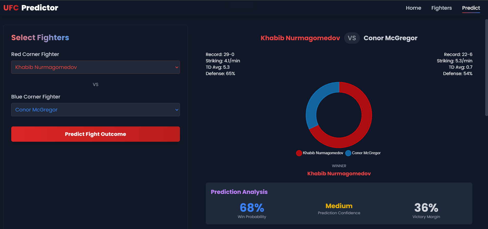
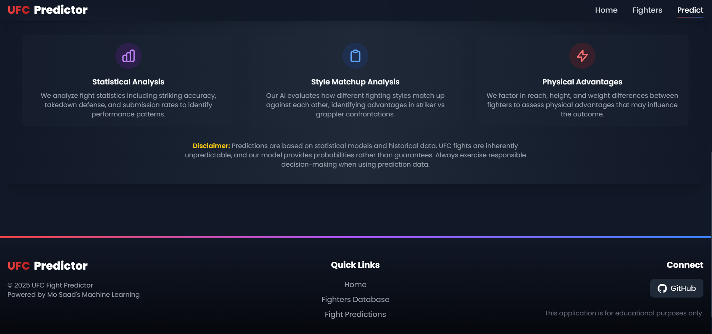
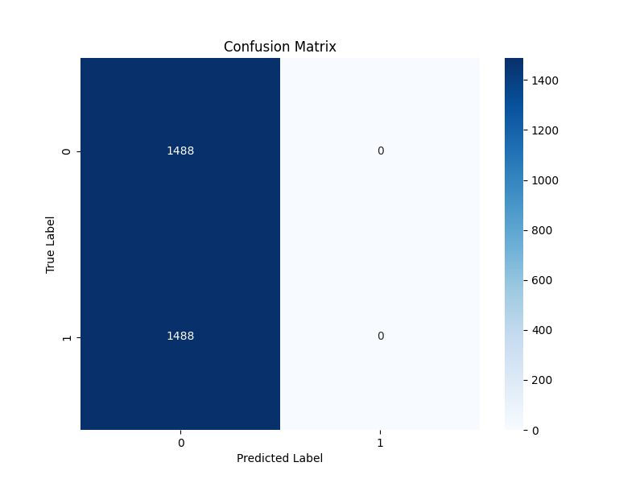
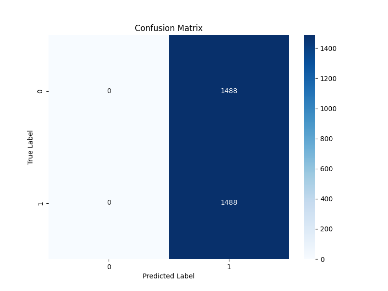

<p align="center">
  
  
  
  
</p>

# Mo's UFC Predictor

UFC Predictor is a machine learning-powered web application that predicts fight outcomes in the Ultimate Fighting Championship (UFC). Using advanced neural networks and a comprehensive database of fighter statistics, this tool provides data-driven predictions for upcoming UFC matchups with detailed probability analysis.

### Live Demo: COMING SOON

## Application Screenshots

### Home Page

*The home page showcases top fighters, prediction statistics, and the main features of the UFC Predictor application. The system boasts 93% prediction accuracy for championship fights and contains data on 2,450+ UFC fighters.*

### Fighter Database

*Browse through our comprehensive database of UFC fighters with detailed statistics including win rate, striking metrics, and takedown averages.*

### Prediction Interface

*Select fighters from different corners and get detailed prediction analysis with win probabilities and confidence ratings. The system analyzes physical advantages, fighting styles, and historical performance.*

### Prediction Results Example

*Example prediction for Khabib Nurmagomedov vs Conor McGregor, showing a 68% win probability for Khabib with medium confidence and 36% victory margin.*

### Application Features

*Overview of key analytical features: Statistical Analysis, Style Matchup Analysis, and Physical Advantages assessment used in the prediction model.*

### Model Evolution

The development process included addressing several ML challenges. Below are confusion matrices from early prototypes:

  
*Confusion matrix from an early prototype showing significant overfitting issues. This initial model predicted all outcomes as a single class (all predictions as 0), demonstrating the challenges in balancing the training data.*

<br>

  
*Another early prototype displaying the opposite problem - predicting all outcomes as class 1. These initial models helped identify gradient loss issues and led to the development of the current balanced ensemble approach.*


## Features

### AI-Driven Fight Predictions
- **Ensemble Machine Learning Model**: Combines XGBoost (2.5x weight), Random Forest (1.5x weight), Gradient Boosting (1.0x weight), and Logistic Regression (0.5x weight)
- **Neural Network Model**: PyTorch implementation with multiple hidden layers, batch normalization, and dropout
- **Probability Analysis**: Detailed win probability with confidence ratings
- **Physical Matchup Evaluation**: Accounts for weight class, reach, and other physical advantages

### Fighter Database
- **Comprehensive Statistics**: Track records, physical attributes, and performance metrics for 2,450+ fighters
- **Fighter Comparisons**: Side-by-side comparison of fighting styles and statistics
- **Historical Data**: Access to past UFC fight results for analysis

### Modern Web Interface
- **Responsive Design**: Built with React and Tailwind CSS for a seamless experience on all devices
- **Interactive Visualizations**: Dynamic charts for prediction and fighter comparison
- **User-Friendly**: Intuitive interface for both casual fans and MMA analysts

## Tech Stack

### Backend
- **Python 3.8+**: Core programming language
- **PyTorch**: Deep learning framework for fight prediction model
- **Flask**: REST API framework
- **SQLite**: Database for fighter and fight data
- **Pandas/NumPy**: Data processing and analysis
- **XGBoost/Scikit-learn**: Machine learning model implementation

### Frontend
- **React**: UI component library
- **Tailwind CSS**: Utility-first CSS framework
- **Chart.js**: Data visualization
- **Axios**: HTTP client for API communication

## Machine Learning Models

### Ensemble Model Architecture

Our prediction system combines multiple machine learning models for improved accuracy:

1. **XGBoost Classifier** (Weight: 2.5): Handles complex feature interactions and non-linear patterns
   ```python
   xgb_model = xgb.XGBClassifier(
       n_estimators=200,
       learning_rate=0.05,
       max_depth=5,
       min_child_weight=2,
       gamma=0.1,
       subsample=0.8,
       colsample_bytree=0.8,
       objective='binary:logistic',
       eval_metric='auc',
       random_state=42
   )
   ```

2. **Random Forest Classifier** (Weight: 1.5): Captures non-linear relationships with high generalization
   ```python
   rf_model = RandomForestClassifier(
       n_estimators=200,
       max_depth=10, 
       min_samples_split=5,
       min_samples_leaf=2,
       max_features='sqrt',
       bootstrap=True,
       random_state=42
   )
   ```

3. **Gradient Boosting Classifier** (Weight: 1.0): Sequential learning for optimized accuracy
   ```python
   gb_model = GradientBoostingClassifier(
       n_estimators=150,
       learning_rate=0.05,
       max_depth=5,
       min_samples_split=5,
       min_samples_leaf=2,
       subsample=0.8,
       random_state=42
   )
   ```

4. **Logistic Regression** (Weight: 0.5): Provides probabilistic foundation with good explainability
   ```python
   lr_model = LogisticRegression(
       C=1.0,
       penalty='l2',
       solver='liblinear',
       random_state=42,
       max_iter=1000
   )
   ```

### Neural Network Architecture
```python
class UFCPredictor(nn.Module):
    def __init__(self, input_size, hidden_size=128, dropout_rate=0.3):
        super(UFCPredictor, self).__init__()
        
        # Input layer with batch normalization
        self.fc1 = nn.Linear(input_size, hidden_size)
        self.bn1 = nn.BatchNorm1d(hidden_size)
        self.dropout1 = nn.Dropout(dropout_rate)
        
        # Hidden layers with batch normalization
        self.fc2 = nn.Linear(hidden_size, hidden_size // 2)
        self.bn2 = nn.BatchNorm1d(hidden_size // 2)
        self.dropout2 = nn.Dropout(dropout_rate)
        
        self.fc3 = nn.Linear(hidden_size // 2, hidden_size // 4)
        self.bn3 = nn.BatchNorm1d(hidden_size // 4)
        self.dropout3 = nn.Dropout(dropout_rate)
        
        # Output layer
        self.output = nn.Linear(hidden_size // 4, 1)
```

### Feature Engineering
The system leverages advanced feature engineering techniques:

- **Combat Style Effectiveness**: Striking and grappling efficiency ratios
  ```python
  df_enhanced['r_striking_efficiency'] = df_enhanced['r_sig_str_acc_total'] * (1 - df_enhanced['b_str_def_total'])
  df_enhanced['striking_efficiency_diff'] = df_enhanced['r_striking_efficiency'] - df_enhanced['b_striking_efficiency']
  ```

- **Physical Advantage Metrics**: Composite metrics based on height, reach, and weight
  ```python
  height_diff_norm = df_enhanced['height_diff'] / df_enhanced['height_diff'].abs().max()
  reach_diff_norm = df_enhanced['reach_diff'] / df_enhanced['reach_diff'].abs().max()
  weight_diff_norm = df_enhanced['weight_diff'] / df_enhanced['weight_diff'].abs().max()
  df_enhanced['physical_advantage'] = (height_diff_norm * 0.3) + (reach_diff_norm * 0.4) + (weight_diff_norm * 0.3)
  ```

- **Position Bias Mitigation**: Data augmentation with position swapping to prevent red/blue corner bias

## Installation and Setup

### Prerequisites
- Python 3.8+
- Node.js 14+
- npm 7+

### Backend Setup
```bash
# Clone the repository
git clone https://github.com/mo100saad/ufc-predictor.git
cd ufc-predictor/backend

# Create and activate virtual environment
python -m venv venv
source venv/bin/activate  # On Windows: venv\Scripts\activate

# Install dependencies
pip install -r requirements.txt

# Initialize the database and train the model
python main.py --init-and-train

# Start the Flask server
python main.py
```

### Frontend Setup
```bash
# Navigate to the frontend directory
cd ../frontend

# Install dependencies
npm install

# Start the development server
npm start
```
The application will be available at `http://localhost:3000` with the API running at `http://localhost:5000`.

## API Endpoints

| Method | Endpoint | Description |
|--------|---------|-------------|
| GET | `/api/health` | Health check for API status |
| POST | `/api/predict` | Predicts fight outcome between two fighters |
| GET | `/api/fighters` | Returns list of all fighters in the database |
| GET | `/api/fighter/{name}` | Retrieves detailed stats for a specific fighter |
| GET | `/api/fights` | Returns list of recorded fights |
| POST | `/api/manage-csv` | Manages CSV data synchronization |

### Example API Request (Predict Fight)
```json
{
  "fighter1": {
    "name": "Conor McGregor",
    "height": 175,
    "weight": 155,
    "reach": 188,
    "stance": "Southpaw",
    "wins": 22,
    "losses": 6,
    "sig_strikes_per_min": 5.32,
    "takedown_avg": 0.7
  },
  "fighter2": {
    "name": "Khabib Nurmagomedov",
    "height": 178,
    "weight": 155,
    "reach": 178,
    "stance": "Orthodox",
    "wins": 29,
    "losses": 0,
    "sig_strikes_per_min": 4.10,
    "takedown_avg": 5.35
  }
}
```

### Example Response
```json
{
  "prediction": {
    "fighter1_name": "Conor McGregor",
    "fighter2_name": "Khabib Nurmagomedov",
    "fighter1_win_probability": 0.37,
    "fighter2_win_probability": 0.63,
    "predicted_winner": "fighter2",
    "confidence_level": "Medium"
  }
}
```

## Future Roadmap

### Enhanced Prediction Model
- Fighter style matchup analysis
- Time-series analysis of fighter performance trends
- Inclusion of coach and camp data

### Advanced Features
- User accounts with saved predictions
- Live odds comparison with major sportsbooks
- Betting strategy recommendations

### Expanded Coverage
- Prediction for preliminary card fights
- Historical analysis of prediction accuracy
- Fighter career trajectory projections

## Contributing

Contributions are welcome! Please feel free to submit a Pull Request.
```bash
# Fork the repository
# Create your feature branch
git checkout -b feature/amazing-feature
# Commit your changes
git commit -m 'Add some amazing feature'
# Push to the branch
git push origin feature/amazing-feature
# Open a Pull Request
```
---

## 🔒 Copyright & Usage Disclaimer  

**This UFC Predictor project is the original work and intellectual property of Mohammad Saad.**  
It **may not be copied, redistributed, or used commercially** in any form without explicit permission. However, you are welcome to use it **as inspiration** for your own projects.  

If you wish to reference certain aspects of the design, functionality, or methodology, please provide **proper attribution**.  

---

## 📜 License
This project is **Creative Commons Attribution-NonCommercial-NoDerivatives 4.0 International** license. See the [LICENSE](LICENSE) file for details.

---

## Contact
**Mohammad Saad** - [@mo100saad](https://github.com/mo100saad)

Project Link: [GitHub Repository](https://github.com/mo100saad/ufc-predictor)
